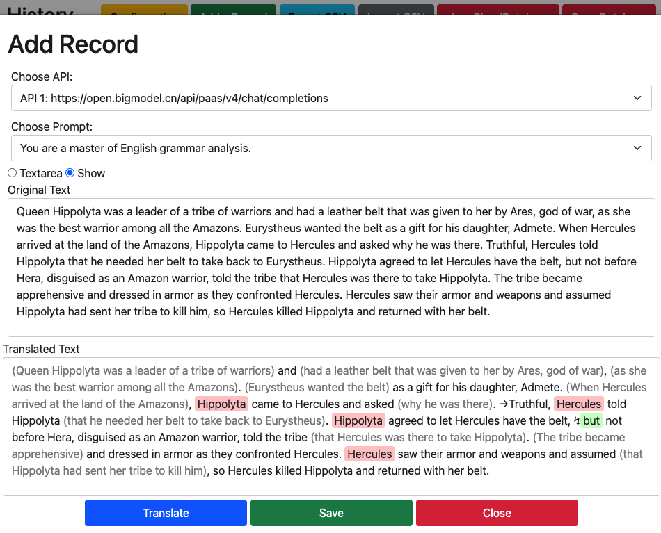

# Grammar Assistant | [中文](readme_zh.md)

## Overview

This Chrome extension is designed to streamline the process of managing translations and grammar analyses by integrating with various APIs. 

The extension provides a simple and intuitive interface for configuring API settings, creating and managing prompts, and viewing or modifying translation and grammar analysis history. 

Additionally, it supports online synchronization, allowing you to keep your data consistent across devices.

## Features

### 1. **Translation or Grammar Analysis**

- **API Configuration**: Manage multiple API configurations for translation and grammar analysis. Users can set API URLs, keys, models, and token limits. A default API can be selected for quick access during translation or analysis tasks. ( Zhipu AI is free now ) 
- **Prompt Management**: Create and manage prompts that guide the translation or grammar analysis process. Set a default prompt to streamline repeated tasks.

### 2. **History Management**

- **View History**: Access a detailed history of all translations and grammar analyses. Each entry is timestamped and includes both the original and the translated/analyzed text.
- **Edit and Add Records**: Modify existing entries or add new records directly from the history view. This feature is useful for refining translations or grammar analyses over time.

### 3. **Data Synchronization**

- **Online Sync**: Sync your translation and analysis history with a remote database, ensuring your data is backed up and accessible across different devices.
- **Conflict Resolution**: If a record with the same content exists, the extension compares timestamps and retains the most recent entry.

### 4. **Import/Export Functionality**

- **Export Configuration**: Export your API and prompt configurations as a JSON file, making it easy to share or backup your settings.
- **Import Configuration**: Import configuration files in JSON format to quickly set up the extension on a new device.
- **CSV Support**: Export your history as a CSV file for external analysis or backup, and import CSV files to restore or update your history.

## Installation

1. Clone the repository or download the folder.

2. Open Chrome and navigate to `chrome://extensions/`.

3. Enable **Developer mode** in the top right corner.

4. Click **Load unpacked** and select the directory where you cloned the repository.

## Usage

### Configuration

1. Open the extension by clicking on its icon in the Chrome toolbar.
2. In the Configuration  tab, set up your API and prompt settings.

   - Add multiple API configurations and set one as the default.
   - Create and manage prompts for translation or grammar analysis.
3. Save your configuration by clicking the **Save** button.
4. Or you can import a config file or output a config file. It supports syncing configuration between devices.

### Managing History

1. Navigate to the **History** tab to view all past translations or grammar analyses.
2. Use the **Add Record** button to manually add a new entry.
3. Click on any entry to edit its contents or delete it if no longer needed.
4. I build a Sync services to syncing history. You can test it. just Use a test token. Dya3bER6tAaVc34f. Sync your history with the remote database using the **Sync Database** button.

### Import/Export

1. To export your current configuration, click on the **Output Config** button in the Configuration tab.
2. To import a configuration, use the **Import Config** button and select a JSON file from your computer.
3. You can also export and import history as CSV files using the corresponding buttons in the History tab.

## Screenshots

### Translation on any website

### Configuration Page

### History Page

### Add Page ( You can modify records)

## Contributing

Contributions are welcome! Please feel free to submit a pull request or open an issue if you have any suggestions or improvements.

## License

This project is licensed under the MIT License. See the LICENSE file for details.

## Contact

For any inquiries or issues, please contact zazaji@sina.com.
