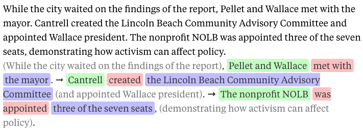
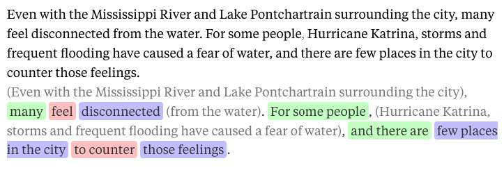
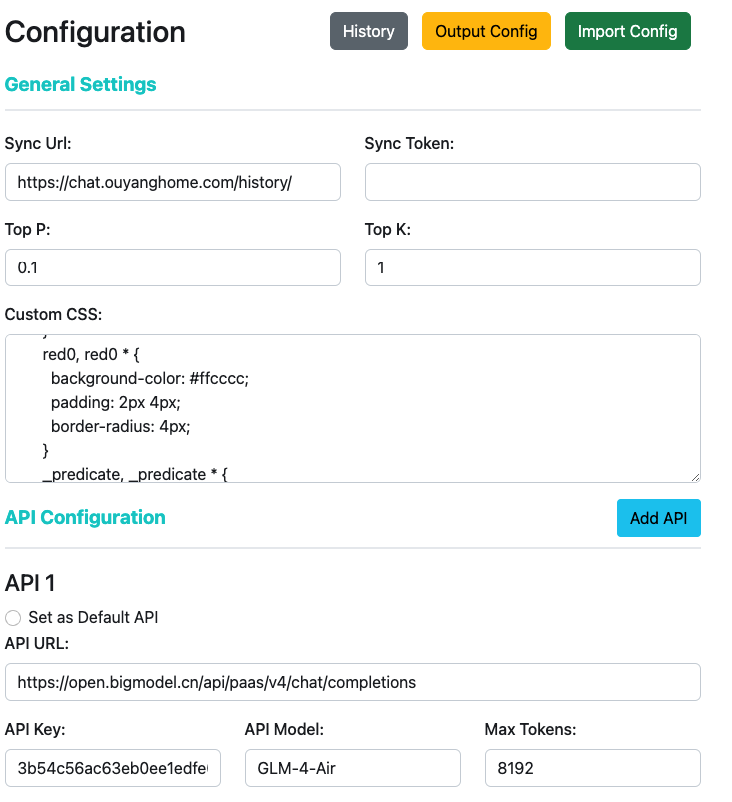
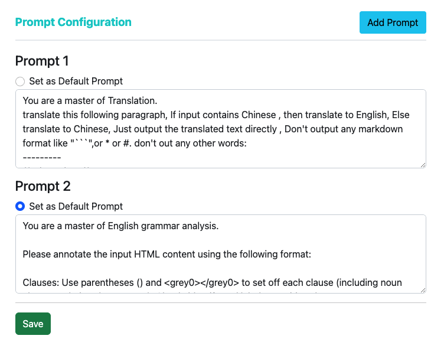
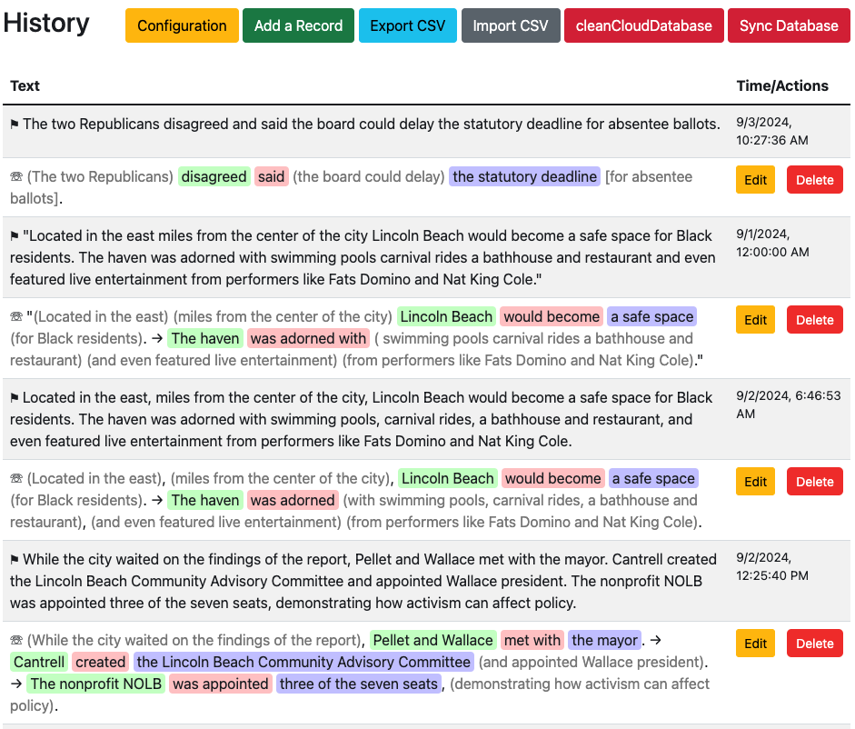
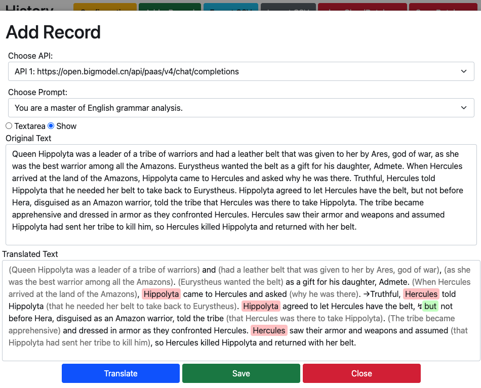

# 语法学习助手－chrome扩展

## 概述

通过集成GPT API 来简化语法学习。插件提供了一个简单直观的界面，用于配置 API 设置、创建和管理提示词，以及查看或修改翻译和语法分析历史记录。此外，还支持导入导出、在线同步。

## 功能特性

### 1. **翻译与语法分析**

- **API 配置**: 管理多个翻译和语法分析 API 配置。用户可以设置 API 的 URL、密钥、模型和token、长度。可以选择默认 API，以便在翻译或分析任务中快速访问。（现在智谱、文心一言都有免费接口，我现在用的智谱，不过免费的语法分析能力太一般）
- **提示词管理**: 创建和管理指导翻译或语法分析过程的提示词。设置默认提示词，以简化重复的任务。你可以改写自己的prompt，实现更多功能，没有做不到，只有想不到。它将不仅仅是一个语法分析工具，而是一个全能的学习助手。

### 2. **历史记录管理**

- **查看历史记录**: 访问所有翻译和语法分析的详细历史记录。每条记录都带有时间戳，包括原文和翻译/分析后的文本。通过历史记录，方便学习回顾。如果有需求可以提出。
- **编辑与添加记录**: 可以直接从历史记录视图中修改现有条目或添加新记录。此功能有助于随着时间的推移优化翻译或语法分析。

### 3. **数据同步**

- **在线同步**: 将您的翻译和分析历史记录与远程数据库同步，确保您的数据得到备份并可在不同设备之间访问。
- **冲突解决**: 精细的控制逻辑，如果存在相同内容的记录，插件会比较时间戳并保留最新的条目。
- 针对要实现修改远程数据库内容需求，建议在做好备份的基础上，先进行同步，然后清空远程数据库，然后本地修改之后再行同步。

### 4. **导入/导出功能**

- **导出配置**: 将您的 API 和提示词配置导出为 JSON 文件，便于共享或备份您的设置。
- **导入配置**: 通过导入 JSON 格式的配置文件，在新设备上快速设置插件。
- **CSV 支持**: 将您的历史记录导出为 CSV 文件，以便进行外部分析或备份，并导入 CSV 文件以恢复或更新历史记录。

## 安装

1. 克隆此仓库或下载文件到文件夹。

2. 打开 Chrome 并导航到 `chrome://extensions/`。

3. 在右上角启用 **开发者模式**。

4. 点击 **加载已解压的扩展程序**，并选择您克隆的仓库目录。

## 使用方法

### 配置

1. 点击 Chrome 工具栏中的插件图标，打开扩展程序。
2. 在 配置 标签页中，设置您的 API 和提示词。
   - 添加多个 API 配置，并设置其中一个为默认配置。
   - 创建和管理用于翻译或语法分析的提示词。
   - 也可以导入之前保存的配置。

### 管理历史记录

1. 导航到 **历史记录** 标签页，查看所有过去的翻译或语法分析记录。
2. 使用 **添加记录** 按钮手动添加新条目。
3. 点击任意条目以**编辑**其内容，也可以**删除**一行。
4. 可以导出为csv、也可以按照导出的格式进行导入。导入不会进行校验，直接进行合并有可能产生重复项。要注意的是，如果有重复项则不同实现数据同步。所以在同步之前，一定要手动删除重复的项目。
5. 我搭建了一个同步数据服务，可以同步历史记录，你可以用这个token进行测试：Dya3bER6tAaVc34f。可以使用 **同步数据库** 按钮将您的历史记录与远程数据库同步。
6. 支持**清空**远程数据库中的内容。

### 导入/导出

1. 要导出当前配置，请点击配置标签页中的 **输出配置** 按钮。
2. 要导入配置，使用 **导入配置** 按钮并从电脑中选择一个 JSON 文件。
3. 您还可以使用历史记录标签页中的相应按钮导出和导入 CSV 文件。

## 截图

### 语法分析界面

### 配置界面

### 记录管理界面

### 增加记录

## 体验

我使用这个插件看英文文章，遇到不懂的就使用快捷键分析一下，特别是句法分析。合上电脑之前点一下同步，在地铁上打开支持chrome插件的浏览器，同步复习。

跟几个朋友讲了，他们还开发出来一些新功能，比如给孩子讲故事。

同时还有一些实用的功能，在自定义css中可以做一些配置，百度界面清爽了。更多功能等待你去开发。只要希望保证知识学习类，需要回顾复习的，都是可以使用。

## 许可证

此项目采用 MIT  LICENSE。

## 联系方式

如有任何疑问或问题，请联系 zazaji@sina.com
